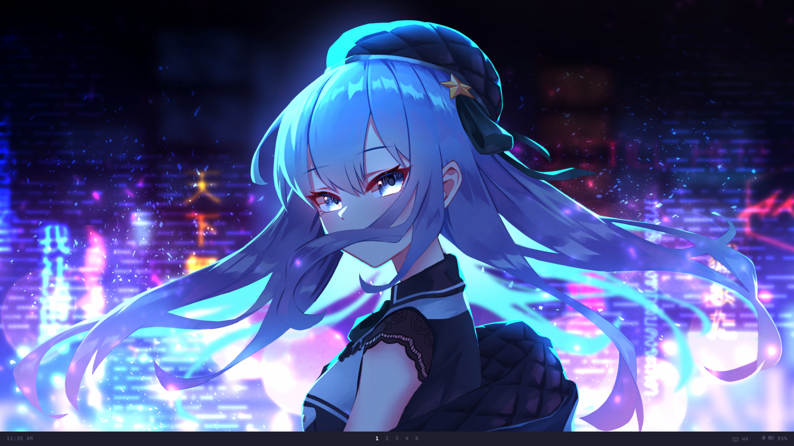

# Info



- **OS**: [Gentoo Linux](https://www.gentoo.org/)
- **WM**: [bspwm](https://github.com/baskerville/bspwm)
- **Terminal**: [alacritty](https://github.com/alacritty/alacritty)
- **Panel**: [Polybar](https://github.com/polybar/polybar)
- **Application launcher**: [Rofi](https://github.com/davatorium/rofi)


# Depedencies
```
x11-wm/bspwm 
media-gfx/scrot 
media-gfx/feh 
x11-misc/sxhkd 
x11-apps/setxkbmap 
x11-apps/xsetroot 
x11-misc/polybar 
x11-misc/rofi 
x11-misc/xclip 
x11-terms/alacritty
```

