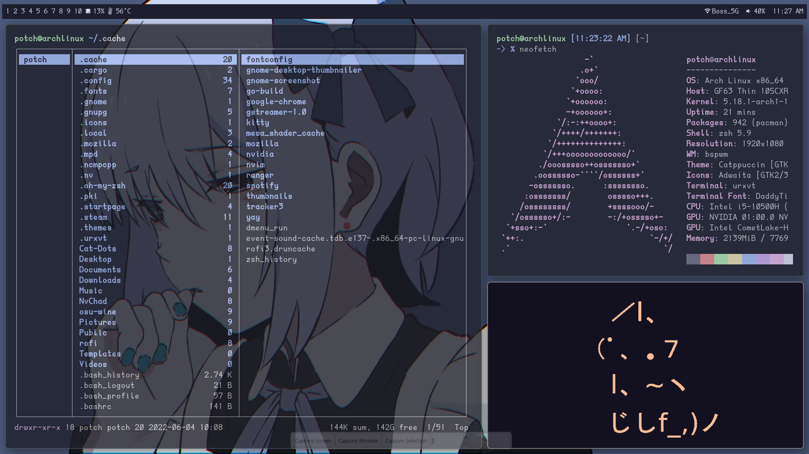
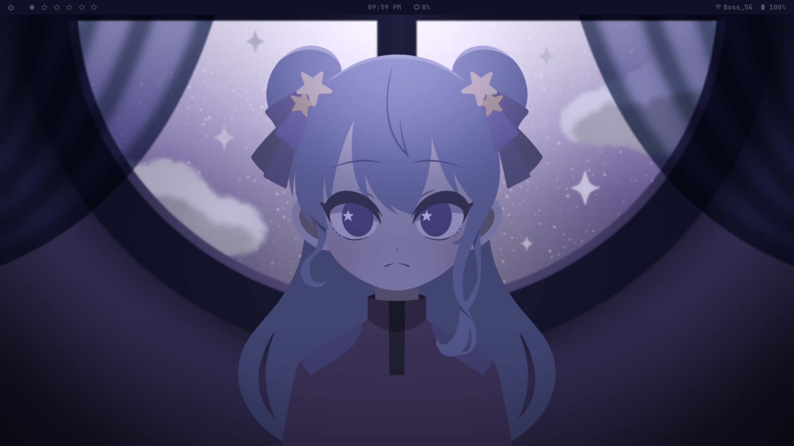

# MY DOTFILES

 <table>
  <tr>
    <th>Info</th>
    <th>Picture</th>
  </tr>
  <tr>
    <td>
     OS:Arch Linux 
     WM:bspwm 
     Term:urxvt 
     Compositor:picom 
     Files manager:ranger 
     Noti:dunst 
     Text Editor:Neovim 
     Bar:Polybar 
   </td><td></td>
  </tr>
 <tr>
  <td>
    OS:Arch Linux 
    WM:bspwm 
    Term:urxvt 
    Compositor:picom 
    Files manager:ranger 
    Noti:dunst 
    Text Editor:Neovim [NvChad](https://github.com/NvChad/NvChad) 
    Bar:Polybar 
    SI:fet.sh 
    APPLET:conky 
  </td>
   <td></td>
 </tr>
 <tr>
  <td>
    OS:Arch Linux 
    WM:bspwm 
    Term:urxvt 
    Files manager:nautilus 
    Noti:dunst 
    Text Editor:Neovim 
    Bar:Polybar 
    SI:pfetch 
  </td>
   <td></td>
 </tr>
</table> 

