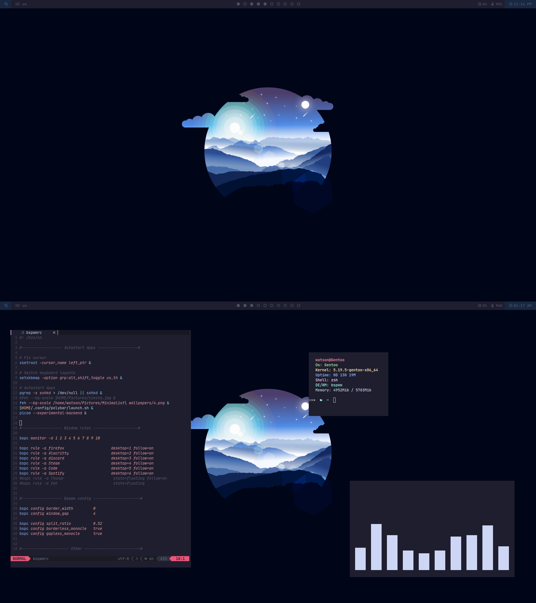

# Info



- **OS**: [Gentoo Linux](https://www.gentoo.org/)
- **WM**: [bspwm](https://github.com/baskerville/bspwm)
- **Terminal**: [alacritty](https://github.com/alacritty/alacritty)
- **Compositor**: [picom-jonaburg](https://github.com/jonaburg/picom)
- **Shell**: [Zsh](https://www.zsh.org/)
- **Panel**: [Polybar](https://github.com/polybar/polybar)
- **File manager**: [Thunar](https://github.com/xfce-mirror/thunar)
- **Application launcher**: [Rofi](https://github.com/davatorium/rofi)
- **Text Editor**: [Neovim](https://github.com/neovim/neovim)

<br />
<br />

# Depedencies
```
emerge -av x11-wm/bspwm media-sound/cava media-sound/pulsemixer media-gfx/scrot media-gfx/feh x11-misc/sxhkd x11-apps/setxkbmap x11-apps/xsetroot x11-misc/picom-jonaburg x11-misc/polybar x11-misc/rofi x11-misc/xclip x11-terms/alacritty xfce-base/thunar app-editors/neovim
```

