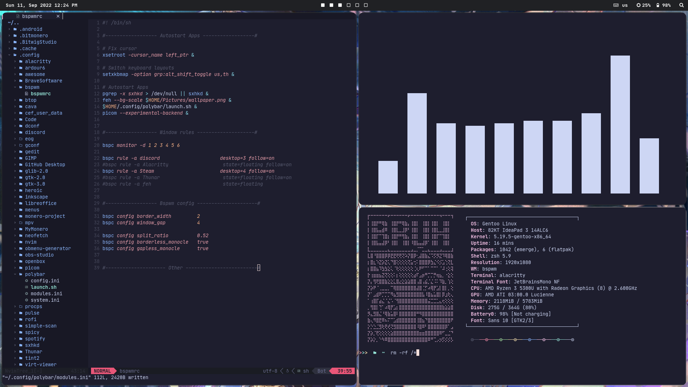

# INFO

- **OS**: [Gentoo Linux](https://www.gentoo.org/)
- **WM**: [bspwm](https://github.com/baskerville/bspwm)
- **Terminal**: [alacritty](https://github.com/alacritty/alacritty)
- **Compositor**: [picom-jonaburg](https://github.com/jonaburg/picom)
- **Shell**: [Zsh](https://www.zsh.org/)
- **Panel**: [Polybar](https://github.com/polybar/polybar)
- **File manager**: [Thunar](https://github.com/xfce-mirror/thunar)
- **Application launcher**: [Rofi](https://github.com/davatorium/rofi)

