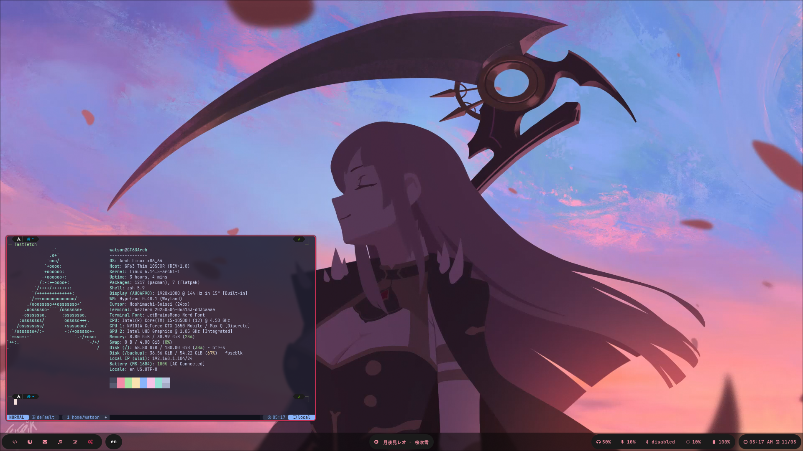

---

## Details

| task | name |
| --- | --- |
| wm | [Hyprland](https://github.com/hyprwm/Hyprland) |
| terminal | [kitty](https://github.com/kovidgoyal/kitty) |
| editor | [neovim](https://github.com/neovim/neovim) |
| bar | [eww](https://github.com/elkowar/eww) |
| notification | [dunst](https://github.com/dunst-project/dunst) |
| file browser | [yazi](https://github.com/sxyazi/yazi) / [nemo](https://github.com/linuxmint/nemo) |
| gtk-theme | [catppucin](https://github.com/catppuccin/catppuccin) |
| font | JetBrainsMonoNF |

---

## Setup

> NOTE: You must have guru repo to be able to install all dependencies.

1. Install dependencies
```bash
emerge --ask gui-wm/hyprland gui-libs/xdg-desktop-portal-hyprland gui-apps/hyprlock \
gui-apps/hyprshot gui-apps/eww gui-apps/wl-clipboard app-misc/yazi \
x11-terms/kitty gui-apps/rofi-wayland gui-apps/swww gnome-extra/nemo app-editors/neovim \
app-misc/brightnessctl media-sound/pulsemixer media-sound/playerctl
```

2. Clone the repo
```bash
git clone https://github.com/Potcharapoll/dotfiles
cd dotfiles
```

3. copy all config
```bash
cp -r config/* $HOME/.config/
cp -r icons/* $HOME/.icons/
cp -r themmes/* $HOME/.themes/
cp -r fonts/* $HOME/.fonts/
cp -r .oh-my-bash/ $HOME/
cp .tmux.conf $HOME/
cp .vimrc $HOME/
```